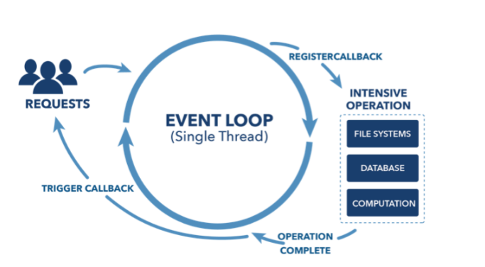

# spring_webflux_aop

## spring webflux

책 "[코틀린 마이크로 서비스 개발](http://acornpub.co.kr/book/microservices-kotlin)"을 통해 spring webflux에 대해 알게 되었고, 이후 이를 [쿠팡 클론 코딩](https://github.com/Leejunhyuck/zzappang) 프로젝트에 적용하여 진행을 하고 있다. spring webflux가 가진 뛰어난 동시성에 대해 간단한 테스트를 진행해보았다.

### spring webflux가 작동하는 방식

spring webflux는 blocking I/O를 이용하는 기존의 spring MVC와는 다르게, node와 비슷하게 event loop을 기반으로 한 nonblocking I/O 방식으로 http 요청을 처리한다.



그래서 spring webflux를 이용하면 적은 스레드 수로도 많은 양의 request를 감당할 수 있고, 높은 동시성을 가진 어플리케이션을 개발할 수 있다.

### 테스트 코드
```kotlin
    @Test
    fun blocking() {
        val restTemplate = RestTemplate()
        val stopWatch = StopWatch()
        stopWatch.start()
        for (i in 0 until 100) {
            val response: ResponseEntity<String>
                    = restTemplate.exchange<String>("http://localhost:8080/test", HttpMethod.GET, HttpEntity.EMPTY, String::class.java)
        }
        stopWatch.stop()
        println(stopWatch.totalTimeSeconds)
    }
```

테스트 방식은 단순하다. 같은 주소로 반복해서 다수의 요청을 보내보는 것이다. 이 api가 하는 일은 아래와 같이, 100만번동안 루프를 돌면서 list에 값을 추가하는 것이다.

```kotlin
@Service
class TestServiceImpl: TestService {
    override fun test(): Mono<Void> {
        val numbers = mutableListOf<Int>()

        for (i in (0 until 10000000)) {
            numbers.add(i)
        }

        return Mono.empty()
    }
}
```

## spring AOP